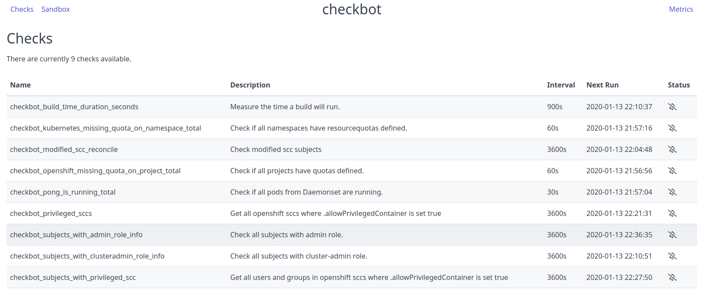

# Checks

## Display Checks

The overview screen will show you a list of all checks that checkbot is currently aware about:



For every check you will also see when the script will run the next time and you have a short indication about the status of the job.

## Writing Checks

Checks are written as shell scripts and need to be saved as .sh files. Each check will provide results in form of one [type of metric](https://prometheus.io/docs/concepts/metric_types/). The checkbot contains [Busybox](https://busybox.net/) running the lightweight ash shell.

### Configuration

A check must contain some metadata for registering the check. Metadata is written as comment and need to contain the following information:

* ACTIVE: Is the check currently active (true|false)
* TYPE: The type of the metric (Gauge)
* HELP: Description of the metric
* INTERVAL: Number of seconds between runs of the check

### Return Values

The return values need to follow a predefined format:
```
value|label1=value1,label2=value2
```
It is also possible to return multiple lines. But be sure that you provide the same labels on each line otherwise it would not be a valid metric.

### Example

The following example is a check that tests if all projects have defined valid resource quotas. The check is implemented for Openshift ([openshift_missing_quota_on_project_total.sh](../scripts/examples/openshift_missing_quota_on_project_total.sh)) but can easily be done for Kubernetes as well ([kubernetes_missing_quota_on_namespace_total.sh](../scripts/examples/kubernetes_missing_quota_on_namespace_total.sh)).

```
#!/bin/sh

# ACTIVE true
# TYPE Gauge
# HELP Check if all projects have quotas defined.
# INTERVAL 60

set -eu

# file1 contains all projects
oc get project --no-headers | awk '{print $1}' | sort > /tmp/file1

# file2 contains all quotas
oc get quota --all-namespaces --no-headers | awk '{print $1}' | sort| uniq > /tmp/file2

# result contains projects without quotas
comm -3 /tmp/file1 /tmp/file2 > /tmp/result

# looping through results
while IFS="" read -r p || [ -n "$p" ]
do
  printf '1|project=%s\n' "$p"
done < /tmp/result

exit 0
```

This script will produce results like the following:

```
1|project=grafana
1|project=kube-dns
1|project=test
```
Checkbot will then read the result and convert it into the appropriate Prometheus metric:

```
# HELP checkbot_missing_quota_on_project_total Check if all projects have quotas defined.
# TYPE checkbot_missing_quota_on_project_total gauge
checkbot_missing_quota_on_project_total{project="grafana"} 1
checkbot_missing_quota_on_project_total{project="kube-dns"} 1
checkbot_missing_quota_on_project_total{project="test"} 1
```

## Testing Checks

There is a sandbox you can use to test and debug your check scripts. You have to enable this feature by using the -enableSandbox=true flag.


The sandbox allows you to use all the tools inside the checkbot container (e.g. kubectl, nc, wget, ..). You can run the check and test the result of your script before using it regularly.

> Be aware that the sandbox is able to execute any script you paste and therefore is able to control its container or your local environment.

Default values for authentication using basic auth are admin/admin. The default password for the sandbox endpoint can be changed using the --managementPwd flag.

### Reload

If you change the scripts in your configmap you can use the reload endpoint to reload all scripts:
```
curl -k -X POST -u admin:admin https://localhost:4444/reload
```
Default values for authentication using basic auth are admin/admin. The default password for the reload endpoint can be changed using the --managementPwd flag.
